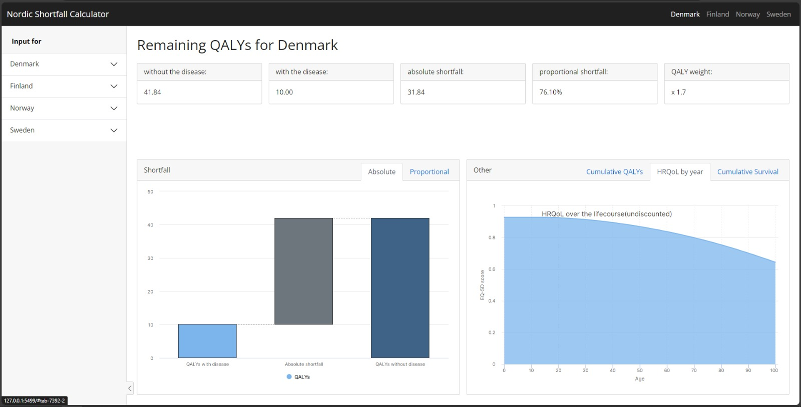

## Nordic Shortfall Calculator

::: columns
::: {.column width="40%"}
The Nordic Shortfall Calculator is a web application that allows user to explore and analyze the quality adjusted life expectancy for the Nordic populations (Denmark, Finland, Norway and Sweden). 

Tuning the parameter produces adjusted estimates for different outcomes like Absolute shortfall, Proportional shortfal HRQoL and Cummulative QALY and survival.

Shiny for R application helps develop app which can deployed at server and then understood by stakeholders easily by interacting with it.

If you would like to get a demo, kindly reach out.

:::

::: {.column width="5%"}
:::

::: {.column width="55%"}

:::
:::

